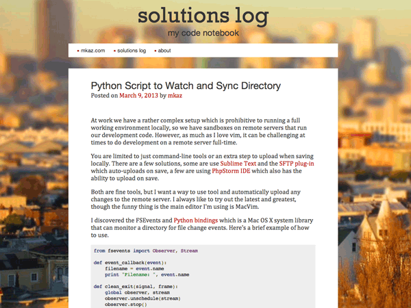

# Solog Theme

Solog is a WordPress theme designed to be great for displaying code, it trys to be minimal and fast. The theme is responsive and will work with desktop, tablets and mobile devices.

### Usage

The theme is setup to automatically syntax highlight your code. Just use the `pre`, or `code` tags and it will try to guess the language. You can also give it a hint using:

    <pre class="lang-py">
		  print("hello python!")
    </pre>

See [Prettify documentation](http://code.google.com/p/google-code-prettify/wiki/GettingStarted) for more syntax highlighting information

### Credits

  * [Normalize.css](http://necolas.github.com/normalize.css/) - don't reset your css to zero, normalize it

  * [Prettify](http://code.google.com/p/google-code-prettify/) - Code Syntax Highlighting

  * [Subtle Patterns](http://subtlepatterns.com/) - background image(s)

  * Kick started using [Underscores.me](http://underscores.me/)

### Author

Marcus Kazmierczak ( [@mkaz](http://twitter.com/mkaz), http://mkaz.com/ )

### License

GNU General Public License.
This theme, like WordPress, is licensed under the GPL.

Use it to make something cool, have fun, and share what you've learned with others.
